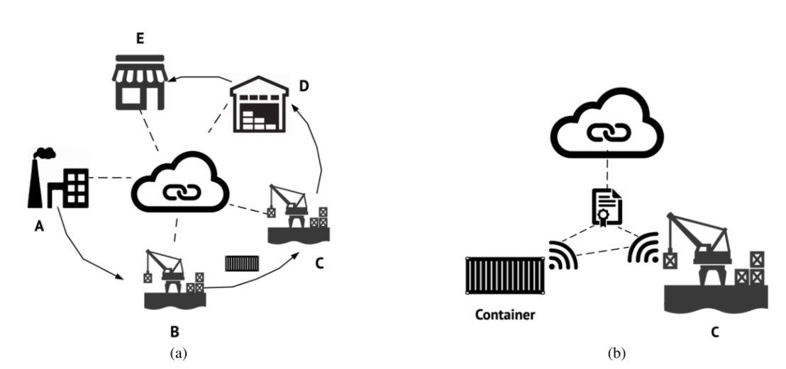

## Requirements
1. Python 3.8
2. Pipenv
3. Git

## Setup

### One-time setup commands
```sh
1. sudo apt-get install pipenv  # if not installed already
2. git clone https://github.com/geetesh-gupta/VanetBlockchain
3. cd VanetBlockchain
4. pipenv install
5. pipenv shell
```

### Daily workspace setup
```sh
1. Go the VanetBlockchain folder
2. Run `pipenv shell`
```

### To run the simulation
```sh
python3 Simulation.py
# if you have `python` set to `python3` in terminal, you can use `python` instead of `python3` in the command
```

### Project Structure
|     File Name         |    Description    |
| -----------------     | ----------------- |
| main.py | Main entry file, currently not updated |
| Simulation.py | Contains the class for Simulation |
| Node.py | Contains the classes for Moving Nodes, Static Nodes and Accidents |
| Sockets.py | Contains client-server messaging socket-based functions | 
| Functions.py | Contains common utility functions |
| BlockChain.py | Contains the class for BlockChain |             
| Block.py | Contains the class for Blocks |                  
| PoWAlgo.py | Contains the code for Proof of Work based calculations |
| Transaction.py | Blockchain Transactions and smart contracts |
|||

### Note !!!
```
Block.py, BlockChain.py, Transaction.py, PoWAlgo.py and main.py currently contains the code from Supply product example. So, that example can be tested by running `main.py`.
```

<!-- # Supply-Blockchain
Blockchain has become a trending topic with the increasing interest of public in crypto-currency such as Bitcoin :moneybag:. This project demonstrates a use-case of blockchain in IoT. This use-case is based on the [Christidis, K. and Devetsikiotis, M., 2016. Blockchains and smart contracts for the internet of things. IEEE Access, 4, pp.2292-2303.](http://ieeexplore.ieee.org/abstract/document/7467408/)

# Asset Tracking
Compared to the traditional tracking, a blockchain network that is set up to track this asset would mean that there is only a single shared database to keep track of, where updates come with cryptographic verifiability, get propagated along the network automatically, and create an auditable trail of information. This allows to prevent disputes between the different parties. 

# Architecture Diagram
The concept could be understood from the below picture:


# Development
The program looks at the functionality that is mandatory for a asset tracking blockchain. The program has been developed on [Python 3.6.1](https://www.python.org/downloads/release/python-361/)

# Usage
1. Run `python3 Supply-Blockchain.py` in the downloaded directory.
2. The number of manufacturer and stakeholder keys need to be specified.
3. The genesis block is generated and the menu is shown to the user.
4. The transactions can be added according to the shipment movement.
5. The mining process selects a random number of transactions to be verified during each run.

# Functionalities
* `View blockchain` - This allows the user to view the entire blockchain structure.
* `Enter transaction` - This allows the user to enter new transactions to the UTXO.
* `View UTXO` - This views the entire list of un-confirmed transactions.
* `Mine block` - This does verification of transactions to be added to a block.
* `Verify blockchain` - This verifies the entire blockchain structure.
* `Generate RSA keys` - New RSA keys for the manufacturer and stakeholders can be created.
* `Track an item` - This allows to track a particular item through the blockchain.

# Screenshots
<p align="center"> 
<p align="center"> 
<p align="center"> 
<p align="center"> 
<p align="center"> 
<p align="center">  -->
